<div align="center">



<br/>

<a href="https://github.com/wupckoding">

</a>

<br/><br/>

[](https://jbnexo.com)
[](mailto:wupckoding@gmail.com)
[](https://www.linkedin.com/in/bruno-de-sousa-henz/)


</div>

---

## O que estou construindo

Eu não coleciono certificados — eu coloco coisa em produção. Três frentes hoje:

| | Projeto | O que faz |
|---|---|---|
| 🧠 | **Painel Claude Code** | Proxy que roda IA em modelos gratuitos — gateway de LLM com roteamento inteligente, streaming e tools |
| 💸 | **Checkout PIX** | Integração de pagamentos PIX em produção, do webhook à conciliação |
| ⚙️ | **JBNEXO** | Produtos full-stack do zero ao deploy: PHP · MySQL · JavaScript · APIs de LLM |

## Como eu trabalho

```php
<?php
final class Bruno extends Developer
{
    public array $entrego   = ['gateways de IA', 'pagamentos PIX', 'tooling p/ Claude Code'];
    public string $filosofia = 'do zero ao deploy — sozinho, funcionando';

    public function resolve(Problema $p): Solucao
    {
        return $this->construir($p)->testar()->deploy(); // sem desculpa, sem enrolação
    }
}
```

<div align="center">


</div>

## Números

<div align="center">


</div>

## Atividade

<div align="center">


<br/>


</div>

<div align="center">


</div>
